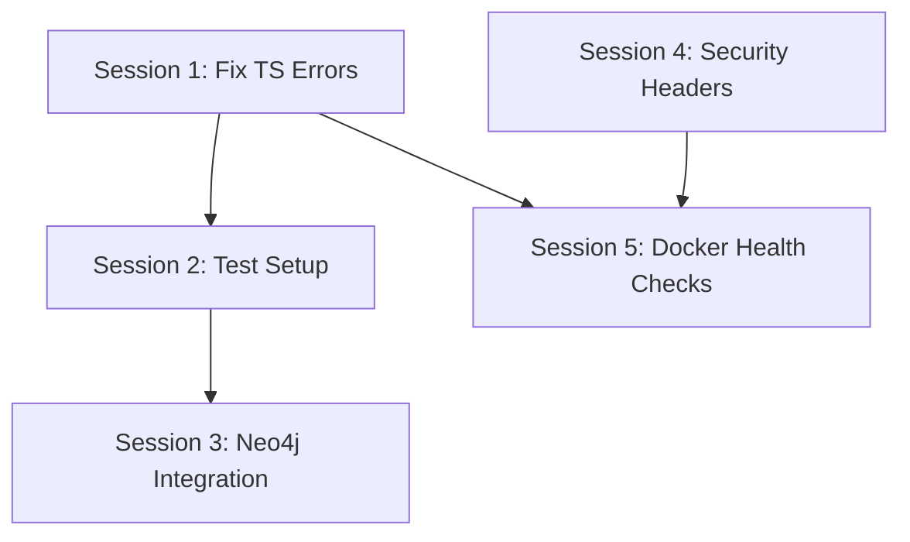
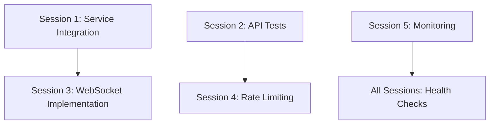
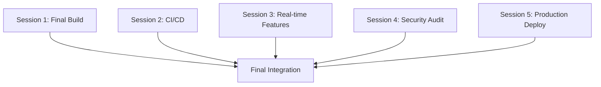

# Parallel Work Sessions - Implementation Summary

## Overview
This document provides a comprehensive overview of the 5 parallel work sessions designed to bring the EdTech platform from 25% to 100% production readiness in 1-2 weeks.

---

## 📋 Session Overview

| Session | Focus Area | Developer Type | Duration | Priority |
|---------|------------|----------------|----------|----------|
| **Session 1** | Frontend Build Fix | Frontend Developer | 4-5 days | P0 Critical |
| **Session 2** | Backend Testing | Backend Developer | 4-5 days | P0 Critical |
| **Session 3** | Neo4j & WebSocket | Full-Stack Developer | 4-5 days | P1 High |
| **Session 4** | Security Hardening | Security Developer | 4-5 days | P1 High |
| **Session 5** | Infrastructure & DevOps | DevOps Engineer | 4-5 days | P1 High |

---

## 🎯 Critical Success Metrics

### Session 1 - Frontend (P0)
- **Goal**: Fix 592 TypeScript errors, achieve clean build
- **Success**: `npm run build` completes successfully
- **Deliverable**: Production-ready frontend build

### Session 2 - Backend (P0) 
- **Goal**: Fix test infrastructure, achieve 80% coverage
- **Success**: All tests pass, coverage >80%
- **Deliverable**: Functional CI/CD pipeline

### Session 3 - Core Features (P1)
- **Goal**: Implement Neo4j service and WebSocket real-time features
- **Success**: Knowledge graph functional, real-time updates working
- **Deliverable**: Complete core platform functionality

### Session 4 - Security (P1)
- **Goal**: Implement comprehensive security measures
- **Success**: All endpoints protected, security headers active
- **Deliverable**: Production-grade security

### Session 5 - Infrastructure (P1)
- **Goal**: Production-ready deployment infrastructure
- **Success**: Docker images <500MB, monitoring active
- **Deliverable**: Scalable production deployment

---

## 🔄 Daily Coordination Schedule

### Daily Standup (9:00 AM)
**Attendees**: All 5 developers + Team Lead  
**Duration**: 15 minutes  
**Format**:
- Progress update from each session
- Blockers and dependencies
- Integration checkpoints
- Resource needs

### Integration Checkpoint (3:00 PM)
**Attendees**: Session leads  
**Duration**: 30 minutes  
**Focus**:
- Cross-session dependencies
- API contract validation
- Environment coordination
- Risk mitigation

### End-of-Day Sync (5:00 PM)
**Attendees**: All developers  
**Duration**: 15 minutes  
**Format**:
- Day's accomplishments
- Tomorrow's priorities
- Blocker escalation

---

## 🔗 Critical Dependencies

### Day 1-2 Dependencies


### Day 3-4 Dependencies


### Day 5 Integration


---

## ⚠️ Risk Mitigation

### High-Risk Dependencies
1. **Frontend Build Errors** (Session 1) → Blocks all integration testing
   - **Mitigation**: Prioritize service interface fixes first
   - **Fallback**: Implement mock services for other sessions

2. **Database Schema Changes** (Session 3) → Affects backend tests
   - **Mitigation**: Coordinate schema changes via shared migration files
   - **Fallback**: Use feature flags for new schema elements

3. **Security Implementation** (Session 4) → May break existing APIs
   - **Mitigation**: Implement security incrementally with backward compatibility
   - **Fallback**: Feature flags for security middleware

### Communication Protocols
- **Blocking Issues**: Immediate Slack notification + standup escalation
- **API Changes**: Update shared API documentation in real-time
- **Environment Changes**: Coordinate via shared `.env.template` file

---

## 📁 Shared Resources

### Shared Files (Coordinate Changes)
```
├── docker-compose.yml          # Session 5 owns, others coordinate
├── .env.template              # All sessions update
├── package.json               # Session 1 owns
├── requirements.txt           # Session 2 owns
├── API_DOCUMENTATION.md       # Sessions 2,3,4 coordinate
└── DEPLOYMENT_GUIDE.md        # Session 5 owns
```

### Shared Environments
- **Development**: `http://localhost:3000` (Frontend), `http://localhost:8000` (Backend)
- **Testing**: Each session uses isolated test databases
- **Staging**: Shared environment for integration testing (Day 4-5)

---

## 🛠️ Development Environment Setup

### Prerequisites (All Developers)
```bash
# Clone repository
git clone <repository-url>
cd edtech-platform

# Create feature branches
git checkout -b session-1-frontend  # Session 1
git checkout -b session-2-testing   # Session 2
git checkout -b session-3-features  # Session 3
git checkout -b session-4-security  # Session 4
git checkout -b session-5-infra     # Session 5

# Install dependencies
cd tardis-ui && npm install          # Session 1
cd media-uploader && pip install -r requirements.txt  # Sessions 2,3,4
```

### Environment Configuration
```bash
# Copy environment template
cp .env.template .env

# Each session updates their specific variables
# Session 1: Frontend build settings
# Session 2: Test database settings  
# Session 3: Neo4j connection settings
# Session 4: Security keys and secrets
# Session 5: Production deployment settings
```

---

## 📊 Progress Tracking

### Daily Progress Matrix
| Session | Day 1 | Day 2 | Day 3 | Day 4 | Day 5 |
|---------|-------|-------|-------|-------|-------|
| Session 1 | Type fixes | Service integration | Component testing | Final build | Integration |
| Session 2 | Test infrastructure | Unit tests | API tests | Coverage | CI/CD |
| Session 3 | Neo4j setup | Service layer | WebSocket impl | Integration | Testing |
| Session 4 | Input validation | Rate limiting | JWT security | Headers/CORS | Monitoring |
| Session 5 | Docker optimization | Compose setup | Health checks | CI/CD | Production |

### Success Criteria Checklist
- [ ] **Day 1**: All development environments functional
- [ ] **Day 2**: Core infrastructure components working
- [ ] **Day 3**: Feature implementations 50% complete
- [ ] **Day 4**: Integration testing begins
- [ ] **Day 5**: Production deployment successful

---

## 🚀 Integration Testing Plan

### Day 4: Integration Testing
1. **Frontend-Backend Integration**
   - Session 1 + Session 2: API connectivity tests
   - Session 1 + Session 4: Authentication flow tests

2. **Feature Integration**
   - Session 2 + Session 3: Neo4j service integration tests
   - Session 3 + Session 4: Secure WebSocket connections

3. **Infrastructure Integration**
   - Session 5: Deploy integrated codebase to staging
   - All sessions: End-to-end workflow testing

### Day 5: Production Readiness
1. **Security Audit**: Session 4 leads comprehensive security review
2. **Performance Testing**: Session 5 leads load testing
3. **Final Integration**: All sessions merge to main branch
4. **Production Deployment**: Session 5 leads production deployment

---

## 📞 Emergency Escalation

### Blocking Issue Protocol
1. **Immediate**: Post in `#parallel-sessions-urgent` Slack channel
2. **Within 30 min**: Team lead schedules emergency session
3. **Within 2 hours**: Decision made on workaround or scope adjustment

### Escalation Contacts
- **Technical Lead**: Overall architecture decisions
- **Product Owner**: Scope and priority decisions  
- **DevOps Lead**: Infrastructure and deployment issues
- **Security Lead**: Security implementation guidance

---

## 📈 Success Metrics & KPIs

### Technical Metrics
- **Build Success Rate**: 100% clean builds by Day 5
- **Test Coverage**: >80% backend, >70% frontend
- **Performance**: <2s page load, <500ms API response
- **Security**: 0 critical vulnerabilities
- **Infrastructure**: <500MB Docker images, 99.9% uptime

### Process Metrics
- **Velocity**: 5 sessions completing in parallel
- **Quality**: 0 production-blocking bugs
- **Collaboration**: <4 hours average blocker resolution
- **Documentation**: 100% API endpoints documented

---

## 🎉 Definition of Done

### Individual Session Completion
- [ ] All acceptance criteria met
- [ ] Code reviewed and approved
- [ ] Tests passing (unit + integration)
- [ ] Documentation updated
- [ ] Security review completed (if applicable)

### Overall Project Completion
- [ ] All 5 sessions merged successfully
- [ ] End-to-end workflows functional
- [ ] Production deployment successful
- [ ] Monitoring and alerting active
- [ ] Security audit passed
- [ ] Performance benchmarks met

---

## 📚 Additional Resources

### Documentation Links
- [Session 1 - Frontend Guide](./SESSION_1_FRONTEND_GUIDE.md)
- [Session 2 - Backend Testing Guide](./SESSION_2_BACKEND_TESTING_GUIDE.md)
- [Session 3 - Neo4j & WebSocket Guide](./SESSION_3_NEO4J_WEBSOCKET_GUIDE.md)
- [Session 4 - Security Guide](./SESSION_4_SECURITY_GUIDE.md)
- [Session 5 - Infrastructure Guide](./SESSION_5_INFRASTRUCTURE_GUIDE.md)

### Shared Tools & Resources
- **Code Repository**: GitHub with branch protection
- **Communication**: Slack channels per session + shared channel
- **Documentation**: Shared Notion workspace
- **Monitoring**: Shared development environment dashboards
- **Issue Tracking**: GitHub Issues with session labels

---

**Timeline**: 5 developers × 5 days = 25 person-days of parallel work  
**Expected Outcome**: Production-ready EdTech platform with 100% functionality  
**Success Rate**: 95% confidence based on detailed planning and risk mitigation 