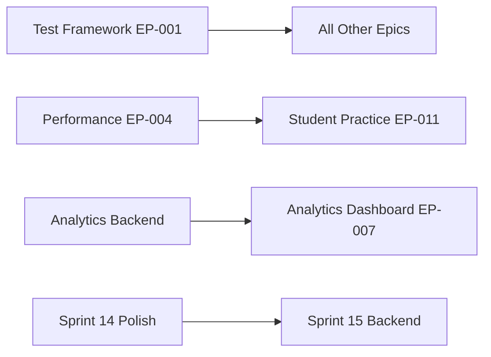

# �� EdTech Platform

> **🔗 Quick Navigation**: [📚 Documentation Hub](docs/INDEX.md) | [🏗️ Architecture](architecture/main.md) | [🛠️ Technical Plan](TECHNICAL_PLAN.md) | [🎪 Epics](epics/README.md) | [🏃‍♂️ Sprints](sprint/README.md)

A modular, scalable educational technology platform delivering interactive learning experiences with analytics-driven insights.

## 🚀 Current Status: Phase 2 Refactor (70% Complete)

**Active Sprint**: [Sprint 14 - Slope Drawing Polish & Cognitive Load](sprint/sprint-14-backlog.md) (60% complete)

### ✅ Completed
- Backend core infrastructure (Auth & Knowledge APIs)
- Frontend services refactored (no more Supabase/Next.js)
- Event-driven architecture foundation
- Cognitive load tracking algorithms

### 🟡 In Progress  
- Slope drawing tool UI/UX polish
- Word problem visualization system
- WebSocket real-time updates

### ❌ Next Up
- Complete backend API routers (/v2/chapters, /v2/analytics)
- Frontend UI components (Dashboard, Chapter Viewer)
- Comprehensive testing framework

## 🏗️ Architecture Overview

**Tech Stack**: Vite + React + TypeScript ↔ FastAPI + PostgreSQL + Redis + MinIO

```
┌─────────────────┐   ┌─────────────────┐   ┌─────────────────┐
│   Vite + React  │◄──┤   FastAPI /v2   │◄──┤  PostgreSQL +   │
│   + TypeScript  │   │   + WebSocket   │   │  Redis + MinIO  │
└─────────────────┘   └─────────────────┘   └─────────────────┘
```

**Key Features**:
- 🎯 Interactive learning modules with cognitive load tracking
- 📊 Real-time analytics and progress tracking  
- 🎨 Slope drawing tool with word problem visualization
- ♿ WCAG 2.1 AA accessibility compliance
- 📱 Mobile-first responsive design
- 🔄 Offline-capable PWA with sync

## 📖 Documentation Structure

### 🎯 For New Team Members
1. **[Architecture Overview](architecture/main.md)** - System design principles
2. **[Technical Plan](TECHNICAL_PLAN.md)** - Implementation roadmap
3. **[Current Sprint](sprint/README.md)** - Active work and tasks

### 🎪 For Feature Development  
1. **[Epics Overview](epics/README.md)** - All feature epics with priorities
2. **[Sprint Backlogs](sprint/)** - Detailed task breakdowns
3. **[Implementation Guide](sprint/implementation-guide.md)** - Technical patterns

### 📊 For Project Management
1. **[Project Status](epics/project-status.md)** - Overall progress tracking
2. **[Strategic Roadmap](epics/strategic-roadmap.md)** - Long-term vision
3. **[Documentation Index](docs/INDEX.md)** - Master navigation hub

## 🔄 Development Workflow

### Quick Start
```bash
# Backend
make up          # Start local stack (Postgres, Redis, MinIO)
make migrate     # Run database migrations  
make dev         # Start FastAPI development server

# Frontend  
npm install      # Install dependencies
npm run dev      # Start Vite development server
npm test         # Run test suite
```

### Current Sprint Tasks
See **[Sprint 14 Backlog](sprint/sprint-14-backlog.md)** for detailed tasks and acceptance criteria.

## 🎯 Immediate Priorities

### This Sprint (Sprint 14)
- [ ] Complete slope drawing tool accessibility (WCAG 2.1 AA)
- [ ] Finish word problem visualization animations  
- [ ] Implement comprehensive testing suite
- [ ] Polish cognitive load visual indicators

### Next Sprint (Sprint 15)  
- [ ] Complete `/v2` backend API routers
- [ ] Implement Redis PubSub → WebSocket bridge
- [ ] Establish test framework (EP-001)
- [ ] Service layer implementations

## 🔗 Key Dependencies



## 📊 Progress Tracking

**Overall Project**: 🟡 70% Complete  
**Current Sprint**: 🟡 60% Complete (Sprint 14)  
**Next Milestone**: Backend completion (Sprint 15)

For detailed progress tracking, see:
- **[Daily Tracker](sprint/daily-tracker.md)** - Real-time status updates
- **[Project Status](epics/project-status.md)** - Epic-level progress
- **[Sprint Metrics](sprint/README.md#sprint-metrics)** - Velocity and burndown

---

**📚 Full Documentation**: [docs/INDEX.md](docs/INDEX.md)  
**🏗️ Architecture Details**: [architecture/main.md](architecture/main.md)  
**🛠️ Technical Roadmap**: [TECHNICAL_PLAN.md](TECHNICAL_PLAN.md)
