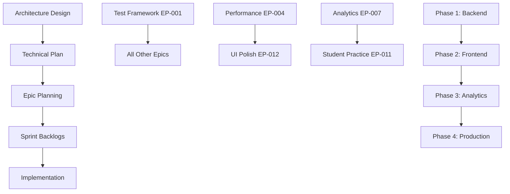

# 📚 EdTech Platform Documentation Index

> **Master Navigation Hub** - All documentation, dependencies, and cross-references

## 🎯 Quick Navigation

### 🏗️ Architecture & Planning
- **[Architecture Overview](../architecture/main.md)** - System design, components, security
- **[Technical Implementation Plan](../TECHNICAL_PLAN.md)** - Two-phase refactor roadmap
- **[Strategic Roadmap](../epics/strategic-roadmap.md)** - Long-term vision and priorities

### 📋 Current Work
- **[Active Sprint](../sprint/README.md)** - Current sprint status and daily tracking
- **[Sprint 14 Backlog](../sprint/sprint-14-backlog.md)** - Slope Drawing Polish & Cognitive Load
- **[Sprint 15 Planning](../sprint/sprint-15-backlog.md)** - Backend completion & WebSocket
- **[Sprint 16 Planning](../sprint/sprint-16-backlog.md)** - Frontend feature parity

### 🎪 Feature Epics
- **[Epics Overview](../epics/README.md)** - All feature epics with priorities
- **[Project Status](../epics/project-status.md)** - Current implementation status

---

## 🔄 Dependency Map

---

## 📖 Documentation Structure

### 🏛️ Foundation Documents
| Document | Purpose | Dependencies | Status |
|----------|---------|--------------|--------|
| [Architecture](../architecture/main.md) | System design & principles | None | ✅ Updated |
| [Technical Plan](../TECHNICAL_PLAN.md) | Implementation roadmap | Architecture | ✅ Updated |

### 🎯 Strategic Planning
| Document | Purpose | Dependencies | Status |
|----------|---------|--------------|--------|
| [Strategic Roadmap](../epics/strategic-roadmap.md) | Long-term vision | Architecture | ✅ Current |
| [Production Roadmap](../epics/roadmap-to-production.md) | Go-live plan | Technical Plan | ✅ Current |
| [Project Status](../epics/project-status.md) | Overall progress | All epics | 🟡 Needs update |

### 🎪 Feature Development
| Epic | Priority | Dependencies | Sprint | Status |
|------|----------|--------------|--------|--------|
| [EP-001: Test Framework](../epics/test-framework-setup.md) | P0 | None | Sprint 15 | ❌ TODO |
| [EP-002: Interactive Quiz](../epics/interactive-quiz-platform.md) | P1 | EP-001 | Sprint 16 | ❌ TODO |
| [EP-003: Responsive Design](../epics/responsive-design-implementation.md) | P1 | EP-001 | Sprint 15 | ❌ TODO |
| [EP-004: Performance](../epics/core-performance-optimization.md) | P1 | EP-001 | Sprint 15 | ❌ TODO |
| [EP-005: Content Management](../epics/content-management-enhancements.md) | P1 | EP-001, EP-004 | Sprint 16 | ❌ TODO |
| [EP-006: Gamification](../epics/gamification-features.md) | P2 | EP-007 | Sprint 17 | ❌ TODO |
| [EP-007: Analytics Dashboard](../epics/analytics-dashboard.md) | P1 | EP-001, Backend Phase 1 | Sprint 16 | ❌ TODO |
| [EP-008: Data Export](../epics/data-export-integration.md) | P2 | EP-007 | Sprint 17 | ❌ TODO |
| [EP-009: Offline Access](../epics/offline-access.md) | P2 | EP-004 | Sprint 17 | ❌ TODO |
| [EP-010: Accessibility](../epics/accessibility-compliance.md) | P1 | EP-003 | Sprint 16 | ❌ TODO |
| [EP-011: Student Practice](../epics/student-practice-module.md) | P1 | EP-001, EP-004, EP-007 | Sprint 14 | 🟡 In Progress |
| [EP-012: Slope Drawing Polish](../epics/slope-drawing-polish.md) | P1 | EP-011, EP-003, EP-010 | Sprint 14 | 🟡 In Progress |

### 🏃‍♂️ Sprint Management
| Sprint | Focus | Duration | Status |
|--------|-------|----------|--------|
| [Sprint 14](../sprint/sprint-14-backlog.md) | Slope Drawing Polish & Cognitive Load | July 3-17 | 🟡 Active |
| [Sprint 15](../sprint/sprint-15-backlog.md) | Backend Completion & WebSocket | July 17-31 | ❌ Planned |
| [Sprint 16](../sprint/sprint-16-backlog.md) | Frontend Feature Parity | July 31-Aug 14 | ❌ Planned |

### 🔧 Implementation Guides
| Guide | Purpose | Dependencies | Status |
|-------|---------|--------------|--------|
| [Implementation Guide](../sprint/implementation-guide.md) | Technical integration patterns | Architecture | ✅ Current |
| [Daily Tracker](../sprint/daily-tracker.md) | Sprint progress tracking | Active sprint | 🟡 Updated daily |

---

## 🚀 Getting Started

### For New Team Members
1. **Start here**: [Architecture Overview](../architecture/main.md)
2. **Understand the plan**: [Technical Plan](../TECHNICAL_PLAN.md)
3. **See current work**: [Active Sprint](../sprint/README.md)
4. **Pick a task**: [Sprint Backlog](../sprint/sprint-14-backlog.md)

### For Project Managers
1. **Strategic view**: [Strategic Roadmap](../epics/strategic-roadmap.md)
2. **Current status**: [Project Status](../epics/project-status.md)
3. **Sprint planning**: [Sprint Schedule](../sprint/sprint-schedule.md)

### For Developers
1. **Architecture**: [System Design](../architecture/main.md)
2. **Implementation**: [Implementation Guide](../sprint/implementation-guide.md)
3. **Current tasks**: [Sprint 14 Backlog](../sprint/sprint-14-backlog.md)

---

## 🔗 Cross-References

### Epic → Sprint Mapping
- **EP-011 & EP-012** → Sprint 14 (Active)
- **EP-001, EP-003, EP-004** → Sprint 15 (Planned)
- **EP-002, EP-005, EP-007, EP-010** → Sprint 16 (Planned)

### Technical Plan → Epic Alignment
- **Phase 1 (Backend)** → Enables EP-007, EP-011
- **Phase 2 (Frontend)** → Delivers EP-002, EP-005, EP-010
- **Phase 3 (Analytics)** → Completes EP-006, EP-008
- **Phase 4 (Production)** → Addresses EP-009, monitoring

### Architecture → Implementation
- **Client Layer** → Frontend epics (EP-002, EP-003, EP-005, EP-010)
- **Application Layer** → Backend epics (EP-007, EP-008)
- **Data Layer** → Storage & analytics epics (EP-006, EP-007)
- **Infrastructure** → Production readiness (EP-009, monitoring)

---

## 📊 Progress Dashboard

### Overall Project Status: 🟡 **70% Complete**
- ✅ **Architecture**: Defined and updated
- ✅ **Backend Core**: Auth & Knowledge APIs implemented
- 🟡 **Frontend**: Services refactored, UI pending
- ❌ **Analytics**: Backend stubs, frontend TODO
- ❌ **Production**: Testing, monitoring, deployment pending

### Current Sprint Status: 🟡 **Sprint 14 - Week 2**
- ✅ **Cognitive Load**: Algorithm improvements complete
- 🟡 **Slope Drawing**: UI polish 60% complete
- ❌ **Testing**: Comprehensive test suite pending
- ❌ **Accessibility**: WCAG compliance pending

---

## 🔄 Update Schedule

- **Daily**: [Sprint tracker](../sprint/daily-tracker.md)
- **Weekly**: Sprint backlog status updates
- **Bi-weekly**: Epic progress reviews
- **Monthly**: Architecture and strategic roadmap reviews

---

## 📝 Documentation Standards

### File Naming Convention
- `README.md` - Overview and navigation
- `epic-name.md` - Feature epic documents
- `sprint-N-backlog.md` - Sprint planning documents
- `implementation-guide.md` - Technical guides

### Cross-Reference Format
- Internal links: `[Link Text](../path/file.md)`
- Epic references: `EP-XXX: [Epic Name](../epics/epic-file.md)`
- Sprint references: `Sprint N: [Focus](../sprint/sprint-N-backlog.md)`

### Status Indicators
- ✅ **Complete** - Fully implemented and tested
- 🟡 **In Progress** - Active development
- ❌ **TODO** - Planned but not started
- 🔄 **Blocked** - Waiting on dependencies

---

*Last updated: $(date)*
*Next review: Weekly sprint planning* 